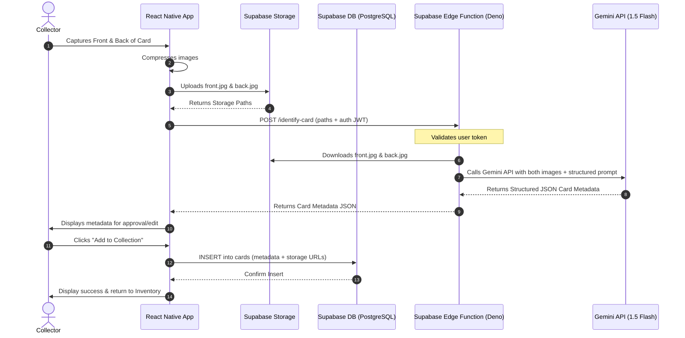

# Product Requirements Document (PRD)

## Sports Card Scanner Mobile App (MVP)

---

## 1. Product Overview
The **Sports Card Scanner** is a React Native/Expo mobile application designed for sports card collectors. It allows users to snap photos of both the **front** and **back** of a sports card (Baseball, Basketball, Football, Soccer, Hockey) and automatically identify it using a Multimodal Large Language Model (Gemini API) via a secure backend (Supabase Edge Functions). Once identified, the card and its metadata are stored in the user's personal digital collection inventory.

### Key Objectives
*   **Automate Cataloging**: Eliminate manual data entry for card collections by using AI-powered image analysis.
*   **Accurate Double-Sided Scanning**: Analyze both front (visual details, player, team, rookie logos) and back (card number, copyright year, statistics, serial numbering) to ensure high-fidelity card identification.
*   **Cloud Inventory**: Save and manage a search-enabled inventory of collected cards securely.
*   **Privacy & Security**: Protect sensitive credentials by proxying all AI requests through serverless backend functions.

---

## 2. Target Audience & Personas
*   **The Hobbyist Collector**: Collects sports cards casually and wants an easy way to track what they own on their phone.
*   **The Rookie Card Hunter**: Actively searches for Rookie Cards (RCs) and needs immediate confirmation if a logo or parallel detail matches rookie specifications.
*   **The Inventory Cataloger**: Has boxes of cards and wants to quickly scan front/back and add them to a database, filtering by sport or year.

---

## 3. Tech Stack
*   **Frontend**: React Native, Expo (SDK 56), Expo Router (file-based navigation), Expo Camera, Expo Image Manipulator.
*   **Styling**: NativeWind (Tailwind CSS for React Native).
*   **Backend (BaaS)**: Supabase.
    *   **Authentication**: Supabase Auth (Email/Password credentials).
    *   **Database**: PostgreSQL with Row-Level Security (RLS).
    *   **File Storage**: Supabase Storage (for storing scanned card front/back images).
    *   **Serverless Code**: Supabase Edge Functions (Deno/TypeScript) for secure API calls.
*   **AI Engine**: Gemini 1.5 Flash (via Google Generative AI SDK on the Edge Function) for fast, low-cost multimodal image analysis.

---

## 4. Functional Requirements

### 4.1. User Authentication
*   Users must be able to sign up using Email & Password.
*   Users must be able to sign in and persist their session.
*   A "Profile" tab allows logging out and displays the active user email.
*   All card cataloging features require an authenticated session.

### 4.2. Double-Sided Scanning Flow
*   **Launch Camera**: The user opens the Scanner tab, presenting a live camera view with a bounding box overlay guiding card placement.
*   **Capture Front**: User snaps the front of the card. A thumbnail preview of the front image is shown at the bottom.
*   **Capture Back**: Bounding box prompt switches to "Capture Card BACK". User snaps the back of the card.
*   **Review Screen**: Both images are displayed side-by-side. The user can either "Re-scan" (discards images and starts over) or "Identify Card".
*   **Image Compression**: Before uploading, the frontend compresses both images (JPEG format, maximum width/height of 1200px, quality ~0.7) to save bandwidth and storage.

### 4.3. Identification Service
*   On clicking "Identify Card", the app:
    1. Uploads the front image to Supabase Storage (`/card-images/user_id/front_unique_id.jpg`).
    2. Uploads the back image to Supabase Storage (`/card-images/user_id/back_unique_id.jpg`).
    3. Calls the Supabase Edge Function (`identify-card`) passing the storage paths of both images.
*   The Edge Function:
    1. Downloads both images from Storage.
    2. Constructs a prompt for the Gemini API, attaching both images.
    3. Calls the Gemini API using `gemini-1.5-flash` with a strict JSON Schema response requirement.
    4. Parses the JSON response and returns it to the React Native client.

### 4.4. Card Detail & Confirmation
*   The app displays the AI's returned properties:
    *   **Player Name**, **Year**, **Brand** (e.g. Topps, Panini, Bowman), **Card Number** (e.g. "US250", "698", "A-1").
    *   **Sport** (Baseball, Basketball, Football, Soccer, Hockey).
    *   **Attributes Flags**: `is_rookie`, `is_insert`, `is_autographed`, `is_memorabilia`.
    *   **Parallel Details**: Attributes like refractor colors, serial numbers (e.g. "12/99"), or print-run descriptions.
*   **Save/Edit Screen**: The user can manually review and edit any field (e.g., in case of AI mismatch) before clicking "Add to Collection".
*   **Discard**: The user can discard the scan, which deletes the files from Supabase Storage and returns to the scanner screen.

### 4.5. Collection Inventory Management
*   Displays a list/grid of all saved cards.
*   **Search**: Search cards by Player Name.
*   **Filters**: Filter collection by Sport, Rookie status (`is_rookie`), Autographed status (`is_autographed`), and Brand.
*   **Detail View**: Tapping a card opens a full details screen showing both front/back images, all metadata, and a "Delete Card" button (which removes the record from the DB and the corresponding images from Storage).

---

## 5. Non-Functional Requirements
*   **Performance (Latency)**: Card identification (including uploads and Gemini API call) should complete in under 8 seconds under normal network conditions.
*   **Security**: No Gemini API keys or admin Supabase service role keys may be stored in the React Native client. The client talks exclusively to Supabase client APIs and the Edge Function using the user's JWT.
*   **Data Integrity**: If a user cancels a scan or deletes a card, the associated files must be deleted from Supabase Storage to prevent orphaned storage accumulation.
*   **Offline Mode**: Scanned collections are cached locally on-device. When offline, users can browse their inventory, but scanning and adding new cards is disabled.

---

## 6. System Architecture



---

## 7. Database Schema

We will use two main tables in Supabase: `profiles` (for user profiles) and `cards` (for the card database).

### 7.1. Table: `profiles`
Holds general user details. Connected to Supabase Auth `users` table via trigger.

| Column Name | Type | Constraints | Description |
| :--- | :--- | :--- | :--- |
| `id` | `uuid` | Primary Key, References `auth.users(id)` | Matches the user's authentication ID |
| `username` | `text` | Unique, Nullable | Public username |
| `created_at` | `timestamp with time zone` | Default `now()` | Date profile was created |

### 7.2. Table: `cards`
Stores the metadata and image references for scanned cards.

| Column Name | Type | Constraints | Description |
| :--- | :--- | :--- | :--- |
| `id` | `uuid` | Primary Key, Default `gen_random_uuid()` | Unique card identifier |
| `user_id` | `uuid` | References `profiles(id)` ON DELETE CASCADE | Owner of the card |
| `front_image_url` | `text` | Not Null | Public URL/path of the front image in Storage |
| `back_image_url` | `text` | Not Null | Public URL/path of the back image in Storage |
| `sport` | `text` | Not Null, Check Constraint | Must be: 'Baseball', 'Basketball', 'Football', 'Soccer', 'Hockey', or 'Other' |
| `player_name` | `text` | Not Null | Extracted player name |
| `year` | `integer` | Not Null | Copyright/release year of the card |
| `brand` | `text` | Not Null | e.g. Topps, Bowman, Panini, Donruss |
| `card_number` | `text` | Not Null | The identifier on the card (e.g. '698', 'RC-3') |
| `is_rookie` | `boolean` | Not Null, Default `false` | Flag if card is a Rookie Card |
| `is_insert` | `boolean` | Not Null, Default `false` | Flag if card is an insert/subset card |
| `is_autographed`| `boolean` | Not Null, Default `false` | Flag if card is autographed |
| `is_memorabilia`| `boolean` | Not Null, Default `false` | Flag if card contains jersey/patch/bat |
| `parallel_attributes` | `jsonb` | Nullable | Stores details like serial number (e.g. `{"serial_num": "45/99", "color": "Blue"}`) |
| `created_at` | `timestamp with time zone` | Default `now()` | Scanned date |

### 7.3. Row-Level Security (RLS) Policies
*   **Profiles Policies**:
    *   `Enable read access for all users` (authenticated).
    *   `Enable insert/update for users based on ID` (users can only edit their own profile).
*   **Cards Policies**:
    *   `Enable read access for owners`: `auth.uid() = user_id` (users can only query their own collection).
    *   `Enable insert for owners`: `auth.uid() = user_id` (users can only add cards to their own account).
    *   `Enable delete for owners`: `auth.uid() = user_id` (users can only delete their own cards).
    *   `Enable update for owners`: `auth.uid() = user_id` (users can only modify their own cards).

---

## 8. AI Prompt & Structured Output Specification

To ensure high-fidelity card identification, the Supabase Edge Function will invoke the Gemini API using system instructions and structured schema outputs.

### System Instructions
```text
You are an expert sports card appraiser and cataloger. You are given two images:
Image 1 is the FRONT of a sports card.
Image 2 is the BACK of a sports card.

Examine both images meticulously to identify the card.
- Look for the player name, team, brand logo (e.g., Topps, Panini, Bowman, Fleer), and year of release.
- Check if it is a Rookie Card. Rookie cards on the front typically have a 'RC' logo, 'Rookie Card' banner, 'Rated Rookie' logo (Donruss/Panini), or Bowman '1st Bowman' logo.
- Check the back of the card to confirm the copyright year, card number (e.g., in a corner or header, prefixed by '#' or letters), and see if there are serial numbers stamped (e.g., '10/99', '250/250').
- Detect if it is an insert card, an autographed card, or a memorabilia card (patch, jersey piece).

Return your findings strictly in the requested JSON structure. Do not guess. If a value is unknown, return an empty string or standard defaults.
```

### Expected Output Schema
The Gemini API will be configured to output JSON conforming to the following structure:
```json
{
  "sport": "Baseball" | "Basketball" | "Football" | "Soccer" | "Hockey" | "Other",
  "player_name": "Ronald Acuña Jr.",
  "year": 2018,
  "brand": "Topps Update",
  "card_number": "US250",
  "is_rookie": true,
  "is_insert": false,
  "is_autographed": false,
  "is_memorabilia": false,
  "parallel_attributes": {
    "serial_num": "",
    "color": "Base",
    "variation": "N/A"
  }
}
```
